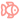
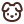
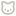

# Игровой движок

- [Обзор архитектуры](#обзор-архитектуры)
- [Типы данных](#типы-данных)
  - [TCell](#tcell)
  - [TGameState](#tgamestate)
  - [TMinesweeperApi](#tminesweeperapi)
- [Хуки](#хуки)
  - [useMinesweeper](#useminesweeper)
  - [useCanvasDraw](#usecanvasdraw)
  - [useHoverAnimation](#usehoveranimation)
  - [useRevealAnimation](#userevealanimation)
  - [useCanvasImages](#usecanvasimages)
- [Компонент игрового поля](#компонент-игрового-поля)
  - [MinesweeperCanvas](#minesweepercanvas)
- [Сервисы](#сервисы)
  - [createGrid](#creategrid)
  - [cloneGrid](#clonegrid)
  - [placeMines](#placemines)
  - [resolveReveal](#resolverevealt)
  - [resolveChord](#resolvechord)
  - [floodReveal](#floodreveal)
  - [drawCell](#drawcell)
  - [getBoardSize](#getboardsize)
- [Константы](#константы)

## Обзор архитектуры

Игра построена на React + Canvas. Логика разделена на три слоя:

- **Хуки** — управляют состоянием и анимациями. `useMinesweeper` хранит всё игровое состояние и предоставляет действия через интерфейс `TMinesweeperApi`. Хуки отрисовки (`useCanvasDraw`, `useHoverAnimation`, `useRevealAnimation`, `useCanvasImages`) отвечают за canvas.
- **Сервисы** — чистые функции без побочных эффектов. Вся игровая логика (расстановка мин, открытие ячеек, проверка победы) живёт здесь.
- **Компоненты** — слой UI. `MinesweeperCanvas` переводит события мыши в вызовы действий и подключает все хуки отрисовки.

Мины не расставляются при инициализации — только при первом клике, чтобы гарантировать безопасный старт.

## Типы данных

### TCell

Описывает одну ячейку игрового поля.

|     Поле     |    Тип    | Описание                                            |
| :----------: | :-------: | :-------------------------------------------------- |
|   **mine**   | `boolean` | является ли ячейка миной                            |
| **revealed** | `boolean` | открыта ли ячейка                                   |
| **flagged**  | `boolean` | установлен ли флаг                                  |
| **adjacent** | `number`  | количество мин среди 8 соседних ячеек               |
| **exploded** | `boolean` | ячейка, на которой подорвался игрок (для подсветки) |

### TGameState

Полное состояние игры, управляется хуком [`useMinesweeper`](#useminesweeper).

|     Поле      |      Тип      | Описание                                    |
| :-----------: | :-----------: | :------------------------------------------ |
|   **grid**    |    `TGrid`    | двумерный массив ячеек `TCell[][]`          |
|  **status**   | `TGameStatus` | `'idle'` / `'playing'` / `'won'` / `'lost'` |
|  **started**  |   `boolean`   | размещены ли мины (после первого клика)     |
| **minesLeft** |   `number`    | количество мин без флагов                   |
|   **time**    |   `number`    | прошедшее время в секундах                  |

### TMinesweeperApi

Публичный интерфейс, который [`useMinesweeper`](#useminesweeper) отдаёт компонентам. Содержит все поля [`TGameState`](#tgamestate) плюс параметры поля и игровые действия.

|     Поле / Метод     | Описание                                                                |
| :------------------: | :---------------------------------------------------------------------- |
|  **rows**, **cols**  | размеры поля в ячейках                                                  |
|      **mines**       | общее количество мин                                                    |
| **reveal(row, col)** | открыть ячейку левым кликом                                             |
|  **flag(row, col)**  | установить / снять флаг правым кликом                                   |
| **chord(row, col)**  | хорд — открыть незафлаженных соседей уже открытой ячейки                |
|     **reset()**      | начать новую игру                                                       |
|      **tick()**      | прибавить 1 секунду к таймеру (вызывается из `GamePage` каждые 1000 мс) |

## Хуки

### useMinesweeper

Центральный хук игровой логики. Принимает сложность (`TDifficulty`) и возвращает [`TMinesweeperApi`](#tminesweeperapi).

```typescript
const api = useMinesweeper('medium')
```

Уровни сложности:

| Уровень  |   Лейбл   | Строки | Столбцы | Мины |
| :------: | :-------: | :----: | :-----: | :--: |
|  `easy`  |  Котёнок  |   9    |    9    |  10  |
| `medium` |    Кот    |   12   |   12    |  20  |
|  `hard`  | Дикий кот |   16   |   16    |  40  |

Жизненный цикл одной игры:

1. Хук инициализируется с пустым полем (`createGrid`), статус `'idle'`
2. При первом клике (`reveal`) — расставляются мины (`placeMines`) так, чтобы первая открытая ячейка и её соседи были безопасны; статус становится `'playing'`
3. Каждый `tick()` увеличивает таймер на 1
4. Победа (`'won'`) — все не-мины открыты; поражение (`'lost'`) — открыта мина
5. `reset()` сбрасывает состояние обратно к шагу 1

При смене сложности (`difficulty`) сброс происходит автоматически через сравнение с `prevDifficultyRef`.

### useCanvasDraw

Управляет отрисовкой игрового поля на `<canvas>`. Вызывается внутри [`MinesweeperCanvas`](#minesweepercanvas).

Принимает параметры:

|     Параметр      | Описание                                                                        |
| :---------------: | :------------------------------------------------------------------------------ |
|   **canvasRef**   | ref на DOM-элемент `<canvas>`                                                   |
|    **drawRef**    | shared ref, куда записывается функция `draw()` для вызова из анимационных хуков |
|     **grid**      | текущая сетка ячеек                                                             |
|  **rows / cols**  | размеры поля                                                                    |
|   **hoverRef**    | координаты ячейки под курсором                                                  |
| **hoverAlphaRef** | текущая прозрачность эффекта ховера (0–1)                                       |
| **revealMapRef**  | Map с прогрессом анимации открытия для каждой ячейки                            |
|    **imgsRef**    | загруженные иконки                                                              |

При каждом вызове `draw()`:

1. Проверяет изменение размеров поля или `devicePixelRatio` — пересоздаёт canvas при необходимости (поддержка Retina)
2. Очищает canvas, заливает фон цветом `border`
3. Перебирает все ячейки и вызывает [`drawCell`](#drawcell) с нужными координатами и альфами анимации

Дополнительно подписывается на `window.matchMedia` по `resolution`, чтобы перерисовать поле при изменении зума браузера.

### useHoverAnimation

Анимирует плавное появление и исчезновение цвета ховера при движении мыши над ячейками.

```typescript
const { hoverRef, hoverAlphaRef, animateHover } = useHoverAnimation({ drawRef })
```

| Возвращаемое значение | Описание                                                           |
| :-------------------: | :----------------------------------------------------------------- |
|     **hoverRef**      | ref с `{ row, col }` ячейки под курсором (`{ -1, -1 }` если нет)   |
|   **hoverAlphaRef**   | текущее значение прозрачности ховера (0–1)                         |
| **animateHover(to)**  | запускает RAF-анимацию изменения alpha с текущего значения до `to` |

Длительность анимации — **120 мс**, интерполяция линейная. При смене ячейки предыдущий RAF отменяется.

### useRevealAnimation

Отслеживает изменения в гриде и запускает fade-in анимацию для только что открытых ячеек.

```typescript
const revealMapRef = useRevealAnimation({ grid, rows, cols, drawRef })
```

Возвращает `revealMapRef` — `Ref<Map<string, number>>`, где ключ `"row-col"`, значение — прогресс анимации (0→1).

Принцип работы:

1. На каждый рендер (`useEffect`) сравнивает текущий `grid` с `prevGridRef`
2. Находит ячейки, у которых `revealed` перешло из `false` в `true`
3. Записывает их в `revealMapRef` с начальным значением `0`
4. Запускает RAF-цикл длительностью **60 мс**, который обновляет progress для всех ячеек в Map
5. По завершении анимации Map очищается

### useCanvasImages

Загружает SVG-иконки один раз при монтировании и инициирует перерисовку canvas после загрузки.

```typescript
const imgsRef = useCanvasImages({ drawRef })
```

| Ключ в `TImgSet` |         Иконка          | Назначение                          |
| :--------------: | :---------------------: | :---------------------------------- |
|     **flag**     |  | флаг на закрытой ячейке             |
|     **mine**     |    | мина на открытой ячейке             |
|  **emptyCell**   |    | открытая пустая ячейка (adjacent=0) |

Все три изображения загружаются параллельно. `draw()` вызывается только когда загружены все три (`pending` счётчик).

## Компонент игрового поля

### MinesweeperCanvas

React-компонент, который рендерит `<canvas>` и обрабатывает пользовательский ввод. Соединяет все анимационные хуки и передаёт действия наружу через пропсы.

Пропсы:

|    Пропс     |         Тип          | Описание                                          |
| :----------: | :------------------: | :------------------------------------------------ |
|   **grid**   |       `TGrid`        | текущее состояние поля                            |
|   **rows**   |       `number`       | количество строк                                  |
|   **cols**   |       `number`       | количество столбцов                               |
|  **status**  |    `TGameStatus`     | статус игры (блокирует ховер при `won`/`lost`)    |
| **onReveal** | `(row, col) => void` | вызывается при левом клике на закрытую ячейку     |
|  **onFlag**  | `(row, col) => void` | вызывается при правом клике                       |
| **onChord**  | `(row, col) => void` | вызывается при левом клике на уже открытую ячейку |

Обработка событий:

|     Событие     | Действие                                                                         |
| :-------------: | :------------------------------------------------------------------------------- |
|    `onClick`    | если ячейка открыта → `onChord`, иначе → `onReveal`                              |
| `onContextMenu` | `onFlag` (правый клик, `preventDefault` блокирует меню браузера)                 |
|  `onMouseMove`  | вычисляет ячейку под курсором, запускает `animateHover(1)` или `animateHover(0)` |
| `onMouseLeave`  | сбрасывает ховер, запускает `animateHover(0)`                                    |

Координаты ячейки из позиции мыши вычисляются функцией `getCellCoordsFromEvent`:

```typescript
const col = Math.floor((e.clientX - rect.left) / (CELL_SIZE + GAP))
const row = Math.floor((e.clientY - rect.top) / (CELL_SIZE + GAP))
```

## Сервисы

Все сервисы — чистые функции (pure functions), не содержат побочных эффектов и не зависят от React.

### createGrid

```typescript
createGrid(rows: number, cols: number): TGrid
```

Создаёт пустое поле размером `rows × cols`. Все ячейки инициализируются как безопасные, закрытые и без флага.

### cloneGrid

```typescript
cloneGrid(grid: TGrid): TGrid
```

Глубокое копирование поля. Используется перед любым изменением состояния, чтобы обновления были иммутабельными.

### placeMines

```typescript
placeMines({ grid, rows, cols, mines, safeRow, safeCol }): void
```

Случайным образом расставляет `mines` мин по полю, мутируя переданный `grid`. Гарантирует, что ячейка `(safeRow, safeCol)` и все её 8 соседей свободны от мин (защита первого клика). После расстановки пересчитывает `adjacent` для всех ячеек.

### resolveReveal

```typescript
resolveReveal(prev, row, col, rows, cols, mines): TGameState
```

Обрабатывает левый клик по закрытой ячейке. Алгоритм:

1. Если игра уже закончена, ячейка открыта или стоит флаг — возвращает `prev` без изменений
2. При первом ходе вызывает `placeMines` (мины ещё не расставлены)
3. Если нажали на мину — вызывает `revealAllMines`, помечает ячейку как `exploded`, статус `'lost'`
4. Иначе — запускает `floodReveal`, проверяет победу через `checkWin`
5. При победе — автоматически флагует все мины (`flagAllMines`), статус `'won'`

### resolveChord

```typescript
resolveChord(prev, row, col, rows, cols): TGameState
```

Обрабатывает клик по уже открытой ячейке с числом. Выполняется только если количество соседних флагов равно `cell.adjacent`. В этом случае раскрывает все незафлаженных соседей. Если среди них оказывается мина — проигрыш.

### floodReveal

```typescript
floodReveal(grid, rows, cols, row, col): void
```

Итеративный flood-fill (стек вместо рекурсии) для открытия пустых областей. Открывает ячейку, затем добавляет всех 8 соседей в стек — но продолжает распространяться только от ячеек с `adjacent === 0`. Ячейки с числами открываются, но не распространяют обход дальше.

```
Пример распространения от пустой ячейки:

  [1][1][1]
  [1][·][1]   ← пустая ячейка открывает все соседние
  [1][1][1]
       ↕
  числа открываются, но не распространяют волну
```

### drawCell

```typescript
drawCell({ ctx, x, y, cell, hoverAlpha, revealAlpha, imgs }): void
```

Отрисовывает одну ячейку на 2D-контексте. Логика отрисовки:

**Закрытая ячейка:**

- заливка цветом `hidden`
- если `hoverAlpha > 0` — поверх накладывается цвет `hover` с `globalAlpha = hoverAlpha`
- декоративная тень-эллипс снизу
- если стоит флаг — иконка 🐟

**Открытая ячейка:**

- сначала заливка цветом `hidden` как основа (для плавного fade-in)
- поверх — `revealed` или `exploded` цвет с `globalAlpha = revealAlpha`
- если мина — иконка 🐶
- если `adjacent > 0` — число цветом из `CANVAS_COLORS.num[adjacent]`
- если `adjacent === 0` — иконка 🐱

Все ячейки обрезаются по скруглённому прямоугольнику (`roundRect` + `clip`) с радиусом `RADIUS = 16`.

### getBoardSize

```typescript
getBoardSize(count: number): number
```

Вычисляет размер стороны canvas в логических пикселях для `count` ячеек:

```
size = count * CELL_SIZE + (count - 1) * GAP + GAP * 2
     = count * (CELL_SIZE + GAP) + GAP
```

## Константы

Определены в [packages/client/src/pages/game/constants/game.ts](../packages/client/src/pages/game/constants/game.ts).

|      Константа       | Значение | Описание                               |
| :------------------: | :------: | :------------------------------------- |
|    **CELL_SIZE**     |   `36`   | размер ячейки в логических пикселях    |
|       **GAP**        |   `4`    | отступ между ячейками                  |
|      **RADIUS**      |   `16`   | радиус скругления углов ячейки         |
| **NEIGHBOR_OFFSETS** |  8 пар   | смещения для перебора 8 соседей ячейки |

Цвета ячеек (`CANVAS_COLORS`):

|     Ключ     |     Цвет      | Используется для                   |
| :----------: | :-----------: | :--------------------------------- |
|  **hidden**  |     cyan      | закрытые ячейки                    |
|  **hover**   |    purple     | ячейка под курсором                |
| **revealed** |    yellow     | открытые ячейки                    |
|  **border**  |     white     | фон canvas (зазоры между ячейками) |
| **exploded** |     pink      | ячейка с миной, на которую нажали  |
|   **num**    | массив цветов | цифры 1–8 (каждая своим цветом)    |
